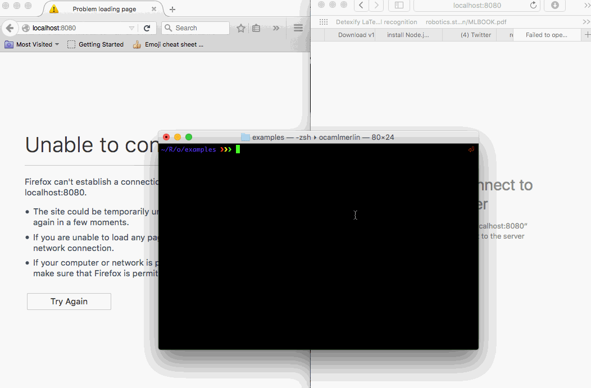

These are [js\_of\_ocaml](https://github.com/ocsigen/js_of_ocaml) bindings to [nodejs](https://github.com/nodejs/node)

Get all the power of the amazing `node` ecosystem with the sanity and
type safety of `OCaml`.

```shell
$ opam install nodejs
```

Working Chat Server


Here's the example's source code: which is located along side its
dependencies and make file in the `examples` directory.

```ocaml
 1  (* Basically a translation of
 2     http://arminboss.de/2013/tutorial-how-to-create-a-basic-chat-with-node-js/ *)
 3  open Nodejs
 4  
 5  let () =
 6    let io = Socket_io.require () in
 7    let server =
 8      Http.create_server begin fun incoming response ->
 9  
10        Fs.read_file ~path:"./client.html" begin fun err data ->
11          response#write_head ~status_code:200 [("Content-type", "text/html")];
12          response#end_ ~data:(String data) ()
13  
14        end
15      end
16    in
17    let app = server#listen ~port:8080 begin fun () ->
18        Printf.sprintf
19          "Started Server and Running node: %s" (new process#version)
20        |> print_endline
21      end
22    in
23  
24    let io = io#listen app in
25    io#sockets#on_connection begin fun socket ->
26  
27      socket#on "message_to_server" begin fun data ->
28  
29        io#sockets#emit
30          ~event_name:"message_to_client"
31          !!(object%js val message = data <!> "message" end)
32  
33      end
34    end
```

The `<!>` infix operator is just a way to get a field of a JavaScript
Object and the `!!` prefix operator is a way lift the js\_of\_ocaml
object literal as a JavaScript object. Notice the high level nature of
the code utilizing OCaml's features like named parameters.

The code assumes that `client.html` is in the same directory, it looks
like this:

```html
 1  <!DOCTYPE html>
 2  <html>
 3  <head>
 4  <script src="https://cdn.socket.io/socket.io-1.3.7.js"></script>
 5  <script type="text/javascript">
 6  var socketio = io.connect("http://localhost:8080");
 7  socketio.on("message_to_client", function(data) {
 8  document.getElementById("chatlog").innerHTML = ("<hr/>" + data['message'] +
 9  document.getElementById("chatlog").innerHTML);
10  });
11  
12  function sendMessage() {
13    var msg = document.getElementById("message_input").value;
14    socketio.emit("message_to_server", { message : msg});
15  }
16  </script>
17  </head>
18  <body>
19          <input type="text" id="message_input"/>
20          <button onclick="sendMessage()">send</button>
21          <div id="chatlog"></div>
22  </body>
23  </html>
```

# Steps to get the example working

I assume that you have `opam`, `js_of_ocaml` and of course `node`
installed. Until I get this all on `opam` you'll need to do the
following steps.

1.  Get the `nodejs` package installed on your machine.

```shell
$ git clone https://github.com/fxfactorial/ocaml-nodejs
$ cd ocaml-nodejs
$ opam pin add nodejs . -y
```

1.  Get the `socket_io` package installed on your machine.

```shell
$ git clone https://github.com/fxfactorial/ocaml-npm-socket-io
$ cd ocaml-npm-socket-io
$ opam pin add socket_io . -y
```

1.  Compile `chat_server.ml` into a working `node` program. Note that
    this will install a local node module, the `socket.io` module.

```shell
$ cd examples
$ make
```

and open up localhost:8080, you'll have a working `node` server.

(Note that you'll only need to call `make` once, afterwards you can
directly just invoke node with `node chat_server.js`.)

# Issues

1.  `node` has a pretty big API so its going to take me a little bit of
    time to cover the API and the bindings that I'm also writing for
    `express` and `socket.io`
2.  `JavaScript`
